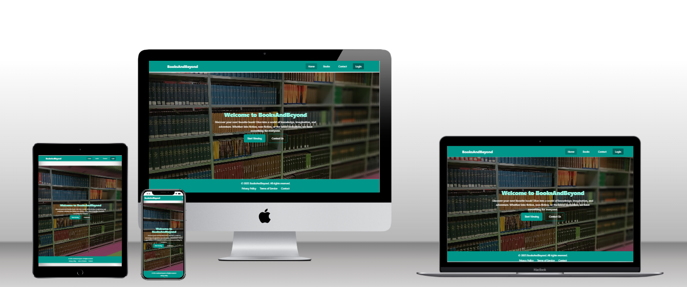

A **Full-Stack web application** where users can explore a variety of books, leave comments, and manage user authentication. Built using **Django Rest Framework (DRF)**, **React**, and **PostgreSQL**, it follows **modern UX/UI and accessibility guidelines** while providing a **fully responsive design**.  
[live Link to the webpage](https://booksandbeyond-v2-0.onrender.com/) 

[Admin Panel](https://booksandbeyond-v2-0-server.onrender.com/admin) 

---

# 📖 BooksAndBeyond 

## 📜 Table of Contents
- [🌟 Project Overview](#-project-overview)
- - [🖥️ UX Design](#️-ux-design)
- [Database Planning](#database-planning)
- [Data Structure](#data-structure)
- [Wireframes](#wireframes)

- [🔄 Logic Flows](#-logic-flows) 
  - [Auth Logic](#auth-logic)
  - [Books Logic](#books-logic)
  - [Contact Logic](#contact-logic)
  
- [⚡ Agile Development](#-agile-development)
  - [Overview](#overview)
  - [User Stories](#user-stories)
  - [List of User Stories](#list-of-user-stories)
- [🎯 Features](#-features)
  - [Features Implemented](#features-implemented)

- [🛠 Technology Stack](#-technology-stack)
  - [API](#api)
- [🧪 Testing](#-testing)
  - [Manual Testing](#manual-testing)
  - [Known Bugs and Issues](#known-bugs-and-issues)
- [🚀 Deployment](#-deployment)
- [📚 Resources](#-resources)
- [🙌 Credits & Acknowledgements](#-credits--acknowledgements)
---

# 🌟 Project Overview 

- Users can browse books, read descriptions, and leave comments.  
- Secure user auth 🔹 Admin Features  
✅ Manage books (Add, Update, Delete)  
✅ Moderate user comments  
✅ Monitor user activity  

[🔝 Back to Top](#-table-of-contents)

## 🖥️ UX Design  

## Database Planning
 
The database structure was planned using **Lucidchart** to visualize relationships between data models.  

## Data Structure  
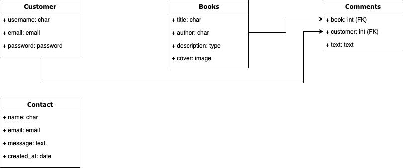

## Wireframes  
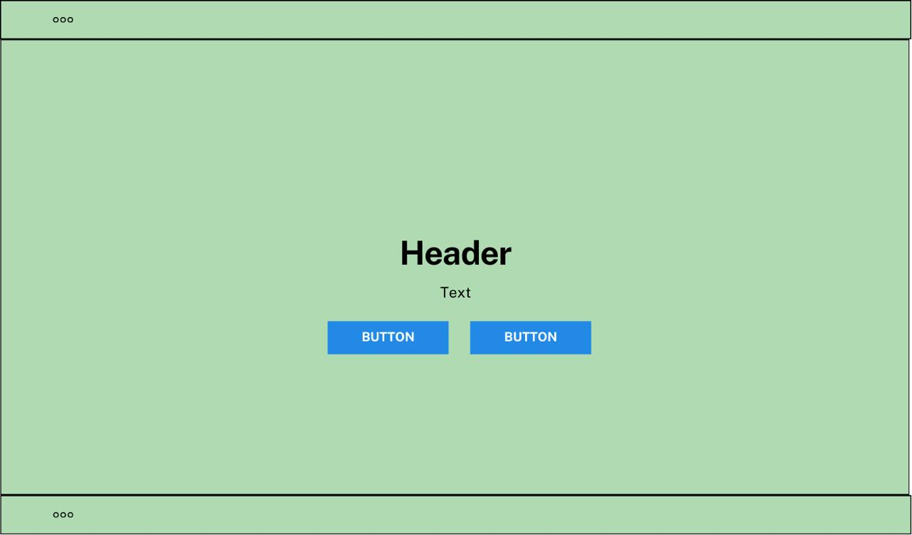

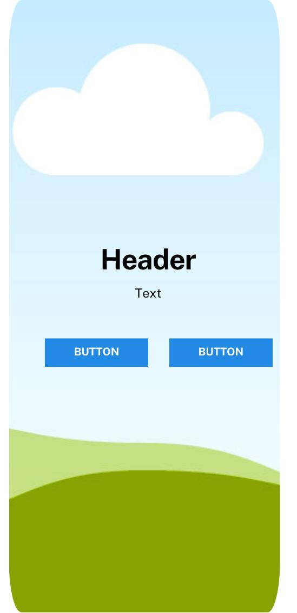

--
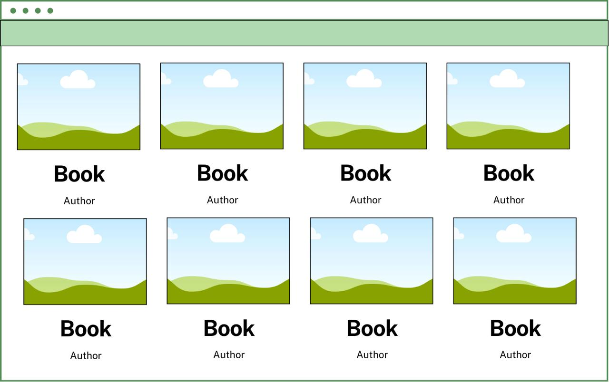


--
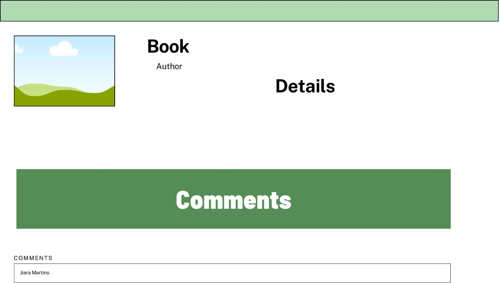

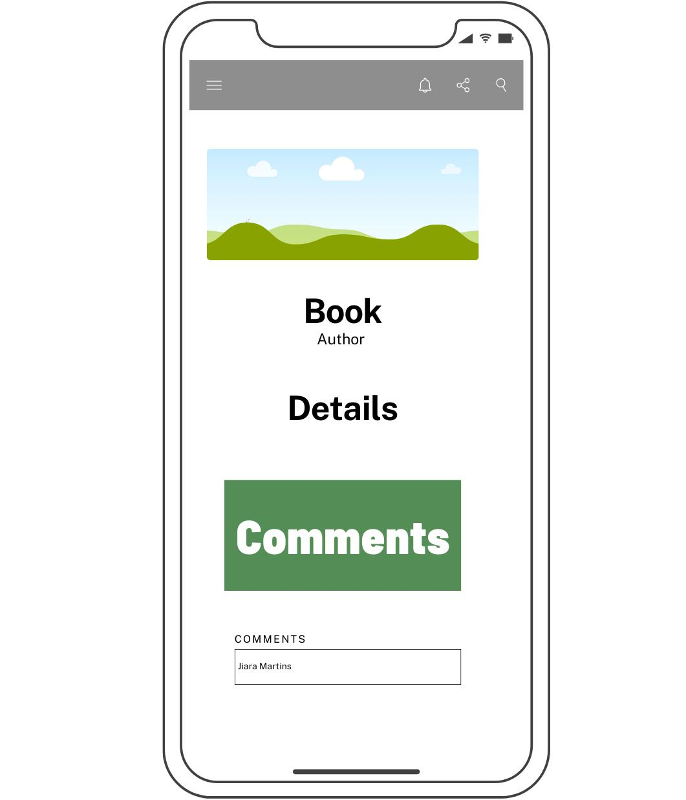

--
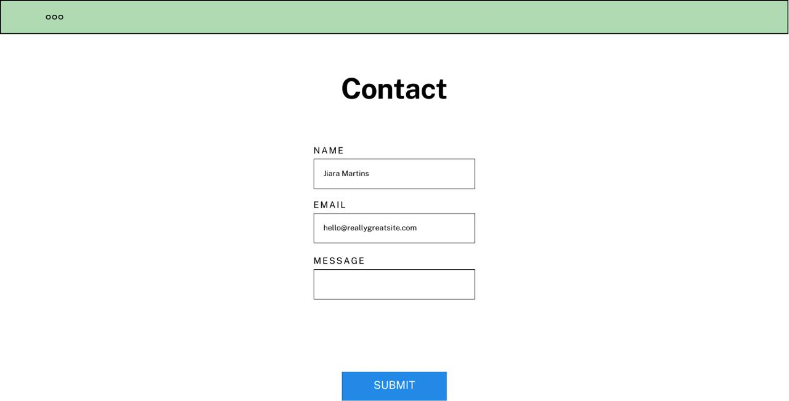

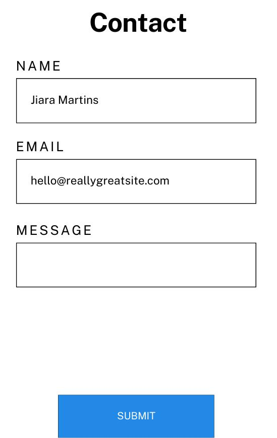

---


# 🔄 Logic Flows  

### 🔐Auth Logic 

## 1. Register Flow
**Purpose:** Allow users to create an account.

### Steps:
1. **Start** → User initiates a registration request.
2. **Validate registration data**:
   - Uses `CustomerRegistrationSerializer` to check fields (e.g., username, password, email).
3. **Is data valid?**  
   - **No** → Return `400 Bad Request` with validation errors (e.g., duplicate email, weak password).  
   - **Yes** → Proceed to the next step.
4. **Create user** → Save the validated data to the database.
5. **Return `201 Created`** (successful registration).

### Key Features:
- Public endpoint (no authentication required).
- Relies on Django REST Framework’s `CreateAPIView` for streamlined user creation.


## 2. Login Flow
**Purpose:** Authenticate a user and generate an access token.

### Steps:
1. **Start** → User submits credentials (e.g., username/password).
2. **Validate login data**:
   - Uses `LoginSerializer` to verify credentials.
3. **Is data valid?**  
   - **No** → Return `400 Bad Request` (e.g., invalid password, missing fields).  
   - **Yes** → Proceed to the next step.
4. **Fetch user** → Extract the validated user from the serializer.
5. **Get/Create token** → Generate a unique auth token (or reuse an existing one).
6. **Return `200 OK`** with the token (used for authenticated requests).

### Key Features:
- Token-based authentication (DRF’s Token model).
- Tokens persist until manually deleted (e.g., during logout).

## 3. Logout Flow
**Purpose:** Invalidate the user’s session by deleting their token.

### Steps:
1. **Start** → User sends a logout request.
2. **Check authentication**:  
   - **No** → Return `403 Forbidden` (unauthorized access).  
   - **Yes** → Proceed to the next step.
3. **Delete token** → Remove the user’s auth token (e.g., `request.user.auth_token.delete()`).
4. **Return `200 OK`** with a success message.

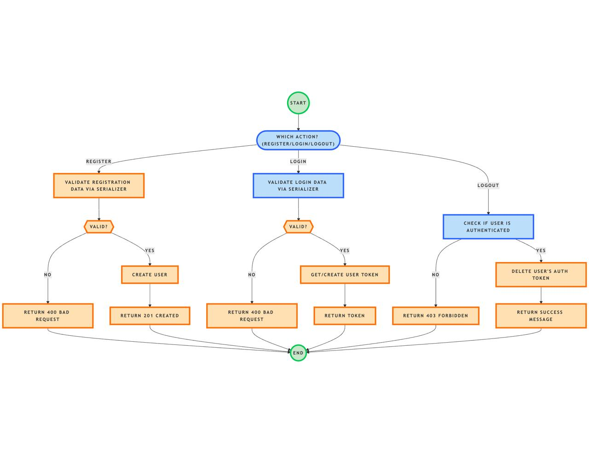


### 📚Books Logic  

1. Start
2. Retrieve book object by ID (from URL/path parameter)
3. Fetch all comments for the book (e.g., book.comments.all())
4. Serialize comments (using CommentSerializer)
5. Return 200 OK with serialized data → End

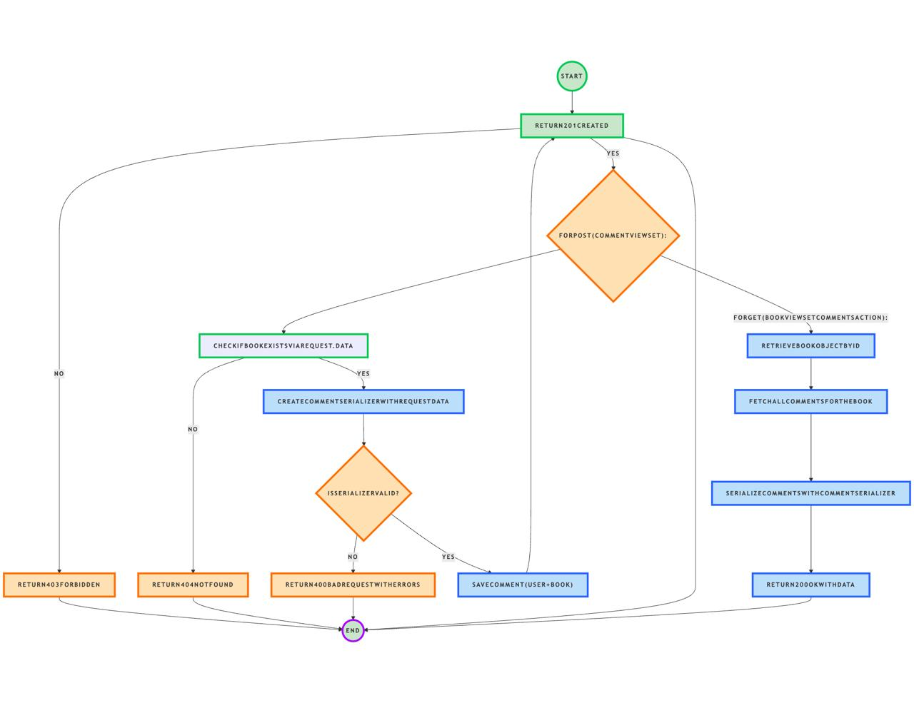


---

### 📩Contact Logic    

1. Start
2. Check request method:
3. POST:
4. Create serializer with request.data
5. Is serializer valid?
6. No:
7. Return 400 Bad Request (with errors) → End
8. Yes:
9. Save data (to database)
10. Return 201 Created → End
11. GET Flow (List Contacts)
12. Start
13. Check request method:
14. GET:
15. Fetch all contacts from the database
16. Serialize contacts data (using ContactSerializer)
17. Return 200 OK (with serialized data) → End

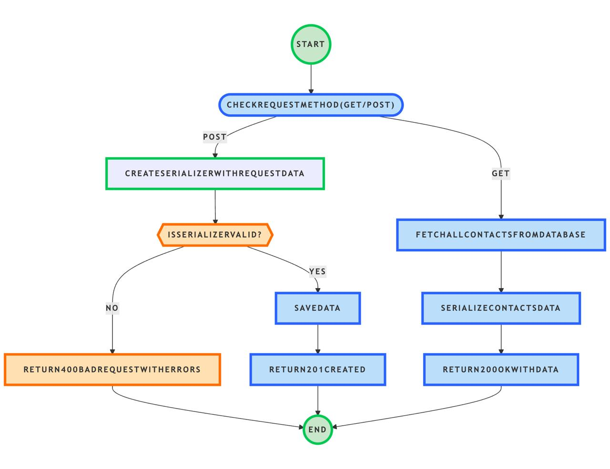

[🔝 Back to Top](#-table-of-contents)


---

## ⚡ Agile Development  

### 📌Overview 

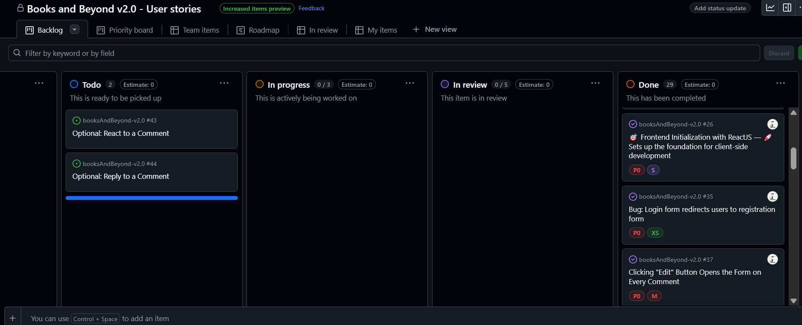

To ensure smooth project management, I utilized the **Agile methodology** combined with a **Kanban board** in GitHub Projects. This approach was effective in tracking progress, managing tasks, and ensuring timely feature delivery.

### 🗂 Issues & Prioritization
- The project included **29 mandatory issues** and **2 optional issues**.
- All issues were prioritized using the **MoSCoW method**:
  - **Must have**
  - **Should have**
  - **Could have**
  - **Won’t have (this time)**

### 🧩 Epics & User Stories
- Development was structured into **epics and user stories**.
- Each user story described a specific feature or functionality.
- Stories were linked to smaller tasks to aid in detailed tracking and progress monitoring.

### ✅ Acceptance Criteria
- Each user story was written with **clear acceptance criteria** to validate feature completeness and align with project goals.

### 🔁 Iterative Development
- Features were implemented in **sprints**, allowing for regular feedback and c

To see the project's **Kanban board**, [click here](https://github.com/users/NewcoderM/projects/4).  


---
  
### 📌User Stories


Each **User Story** included:  
- **Acceptance Criteria**  
- **Bite-sized Tasks** for easy tracking  
- **Bug Tracking & Comments** to document issues and solutions  

As tasks were completed, user stories moved from **"In Progress"** to **"Completed"** in the Kanban workflow.

---

### 📋List of User Stories  

## ✅ Mandatory User Stories

### 1. USER STORY: User needs to authenticate
📝 Users should be able to register, log in, and access personalized content.  
📌 **Acceptance Criteria:**  
- Registration and login forms  
- Session or token-based auth  
- Error handling and validation

---

### 2. USER STORY: Need to contact
📝 Users can reach out via a contact page for support or feedback.  
📌 **Acceptance Criteria:**  
- Contact form with name, email, message  
- Success confirmation on submit  
- Field validation

---

### 3. USER STORY: Need a place to see the books and book details
📝 Users can browse a book list and click for detailed views.  
📌 **Acceptance Criteria:**  
- List view with all books  
- Book detail page with image, title, description, etc.

---

### 4. USER STORY: Need a place to comment on a book
📝 Visitors can leave public comments on book pages.  
📌 **Acceptance Criteria:**  
- Comment form under each book  
- Display comments chronologically

---

### 5. USER STORY: Structure Database
📝 Setup a structured data source for books and comments.  
📌 **Acceptance Criteria:**  
- JSON server with books, categories, comments  
- RESTful endpoints

---

### 6. USER STORY: Create UX
📝 Design user flows and interactions for a smooth experience.  
📌 **Acceptance Criteria:**  
- Responsive design  
- Visual consistency and clarity

---

### 7. USER STORY: User can login & register  
📝 Authentication with user forms and session handling.  
📌 **Acceptance Criteria:**  
- Forms with validation  
- Error display on invalid inputs

---

### 8. USER STORY: Books data from JSON server  
📝 Fetch book data from backend API.  
📌 **Acceptance Criteria:**  
- Axios/fetch integration  
- Display books from JSON

---

### 9. USER STORY: Footer with social media and contact info  
📝 Static footer on all pages.  
📌 **Acceptance Criteria:**  
- Links to social platforms  
- Contact details

---

### 10. USER STORY: Display 404 for unknown routes  
📝 Handle invalid URLs gracefully.  
📌 **Acceptance Criteria:**  
- Catch-all route  
- "Page not found" message

---

### 11. USER STORY: Homepage book categories  
📝 Users can filter by genre or category on the homepage.  
📌 **Acceptance Criteria:**  
- Categories listed visually  
- Filter updates book list

---

### 12. USER STORY: Navbar & routing setup  
📝 Navigation between pages using router.  
📌 **Acceptance Criteria:**  
- React Router with multiple pages  
- Navbar links update route

---

### 13. USER STORY: Book detail dynamic route  
📝 Book pages are accessed through `/books/:id`.  
📌 **Acceptance Criteria:**  
- Dynamic routes with params  
- Load correct book data

---

### 14. USER STORY: Book filter function  
📝 Users can filter books by category/tag.  
📌 **Acceptance Criteria:**  
- Category buttons/dropdown  
- List updates in real time

---

### 15. USER STORY: Comment system UI  
📝 Basic form and layout for comment system.  
📌 **Acceptance Criteria:**  
- Text area, submit button  
- Comments appear below

---

### 16. USER STORY: Book categories from JSON server  
📝 Fetch categories from API instead of hardcoding.  
📌 **Acceptance Criteria:**  
- GET request to `/categories`  
- Use results in UI

---

### 17. USER STORY: Show limited number of comments  
📝 Limit visible comments (e.g., show 3, then expand).  
📌 **Acceptance Criteria:**  
- Display first few comments  
- "Show more" button

---

### 18. USER STORY: Add timestamp to comments  
📝 Each comment should show the time it was posted.  
📌 **Acceptance Criteria:**  
- Human-readable date/time format  
- Appears next to commenter name

---

### 19. USER STORY: Use modal for adding comments  
📝 Comment form opens in a modal overlay.  
📌 **Acceptance Criteria:**  
- Modal component  
- Focus trap and close button

---

### 20. USER STORY: Handle edge cases in commenting  
📝 Prevent empty/duplicate comments.  
📌 **Acceptance Criteria:**  
- Frontend validation  
- User feedback for invalid input

---

### 21. USER STORY: Add loading indicators  
📝 Show spinners when fetching data.  
📌 **Acceptance Criteria:**  
- Loader on API fetch  
- Skeletons or spinners

---

### 22. USER STORY: Responsive layout for mobile  
📝 Mobile-first responsive design.  
📌 **Acceptance Criteria:**  
- Test layout on various screen sizes  
- Hamburger menu if needed

---

### 23. USER STORY: Basic accessibility standards  
📝 Implement basic a11y practices.  
📌 **Acceptance Criteria:**  
- Alt text on images  
- Keyboard navigable UI

---

### 24. USER STORY: Validation for comment form  
📝 Prevent submitting empty or long text.  
📌 **Acceptance Criteria:**  
- Character limits  
- Required fields

---

### 25. USER STORY: Highlight selected category  
📝 Visual indication of the active category filter.  
📌 **Acceptance Criteria:**  
- Active style applied  
- Only one category active at a time

---

### 26. USER STORY: Limit book description length  
📝 On homepage, show a short preview of description.  
📌 **Acceptance Criteria:**  
- Truncate after N characters  
- Add "read more" option

---

### 27. USER STORY: Scroll to top on route change  
📝 Improve UX when navigating pages.  
📌 **Acceptance Criteria:**  
- Page scrolls to top automatically  
- Works across all routes

---

### 28. USER STORY: Improve UX with animations  
📝 Add subtle animations and transitions.  
📌 **Acceptance Criteria:**  
- Use CSS or JS transitions  
- Enhance modals, page changes

---

### 29. USER STORY: Deploy project  
📝 Final deployment of app on live server.  
📌 **Acceptance Criteria:**  
- Live URL available  
- All functionality working in production

---

## 🟡 Optional User Stories

### 1. USER STORY: React to a comment with emoji  
📝 Lightweight reactions to comments.  
📌 **Acceptance Criteria:**  
- Emoji reaction bar  
- Toggleable, shows count

---

### 2. USER STORY: Reply to a comment (threaded)  
📝 Threaded responses under main comments.  
📌 **Acceptance Criteria:**  
- Replies displayed below parent  
- Limited nesting (1–2 levels)

---

## 🧠 Prioritization (MoSCoW)
- **Must Have** → 29 core stories for MVP
- **Could Have** → 2 optional enhancements


[🔝 Back to Top](#-table-of-contents)
---

## 🎯 Features 

### 🔹 User Features  
✅ View a collection of books  
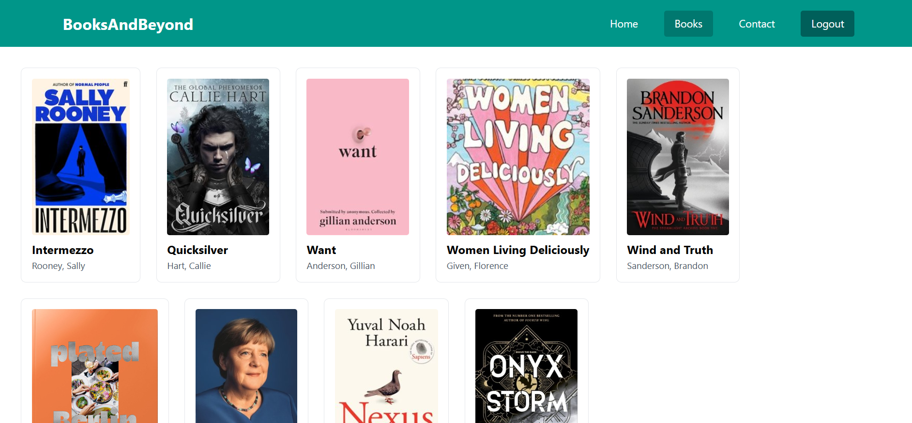

✅ Read details about each book  
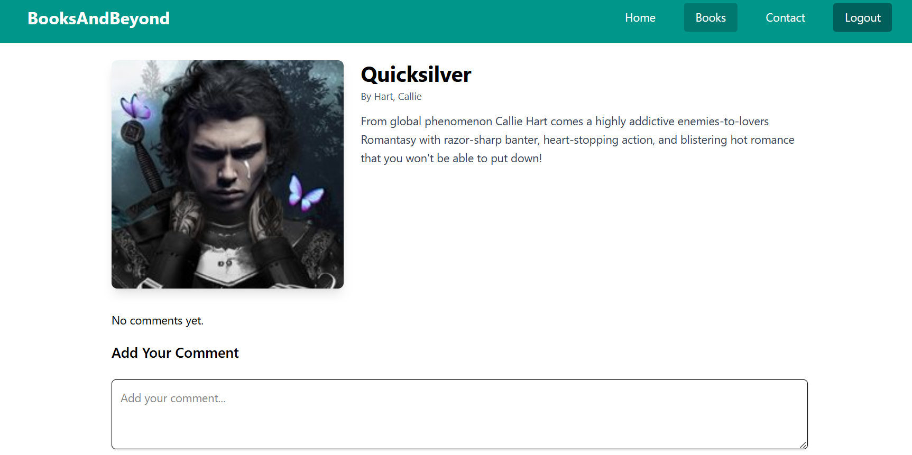

✅ Leave comments on books  
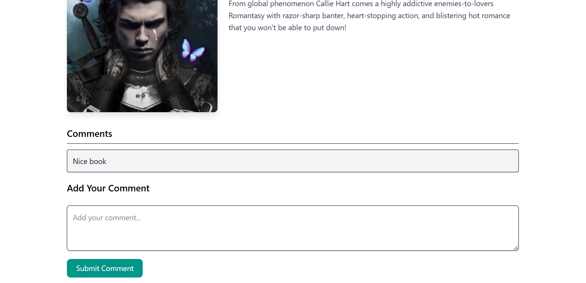

✅ Secure **Login & Logout** system  
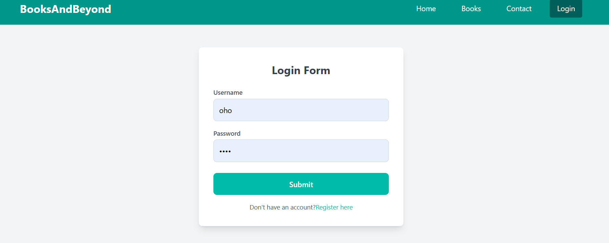


### 🔹 Admin Features  
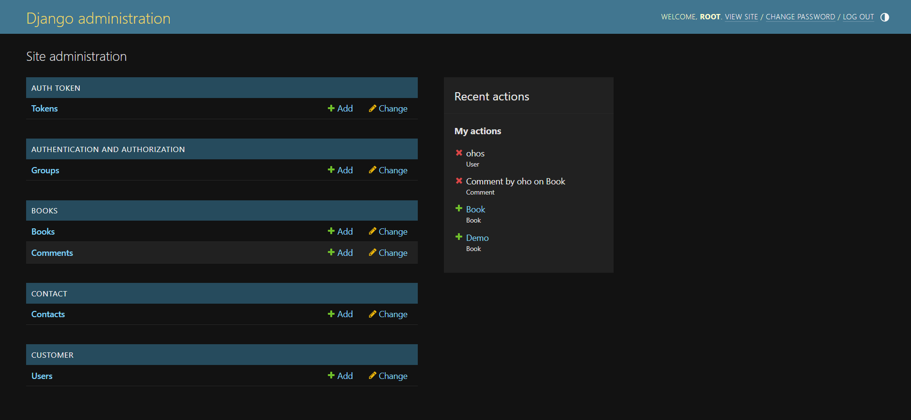

✅ Manage Books


✅ See Users
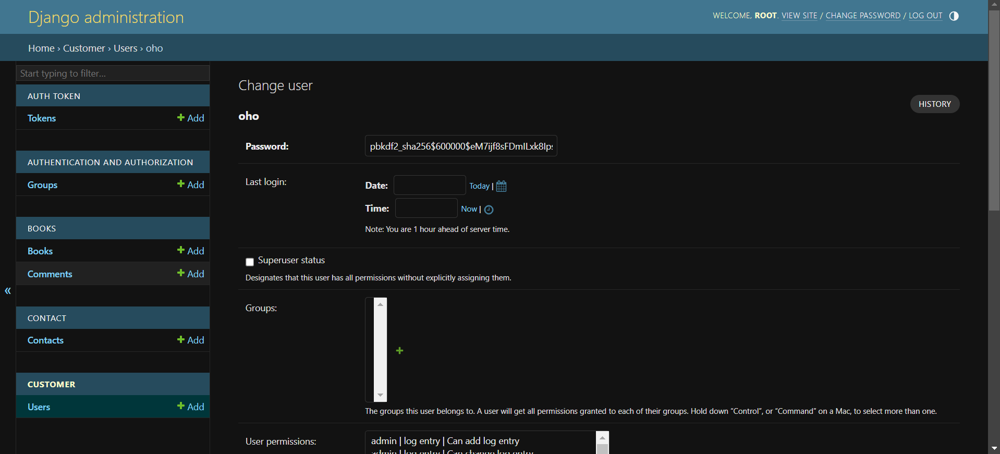

---

[🔝 Back to Top](#-table-of-contents)

---

## 🚀Features Implemented

Each **User Story** contributed to the following implemented features:

### 🔐 **Authentication System**  
- Implemented **user authentication** allowing users to **sign up, log in, and log out** securely.  
- Integrated **password hashing and session management** for security.  
- Ensured proper **authorization**, restricting access to certain features based on authentication status.  
- Utilized **CSRF protection** and security best practices.  

(*Related to:* `USER STORY: User needs to authenticate`)  

---

### 📩 **Contact Page**  
- Created a **dedicated contact page** for users to send inquiries.  
- Integrated **a form submission system** to collect messages from users.  
- Provided **email or backend processing** for handling contact requests.  

(*Related to:* `USER STORY: Need to contact`)  

---

### 📚 **Books and Book Details Page**  
- Designed a **books listing page** showcasing available books.  
- Each book has a **detailed page**, including title, author, description, and other metadata.  
- Implemented **search and filter functionality** for an improved user experience.  

(*Related to:* `USER STORY: Need a place to see the books and book details`)  

---

### 💬 **Book Commenting System**  
- Users can **leave comments** on book pages.  
- Implemented **comment moderation features**, ensuring appropriate content.  
- Comments are displayed in a structured manner, showing user details and timestamps.
- User can update and delete their own comments 

(*Related to:* `USER STORY: Need a place to comment on a book`)  

---

### 🗄️ **Database Structure & Optimization**  
- Designed and structured the **database schema** efficiently.  
- Created **tables/models** for users, books, comments, and related data.  
- Optimized **relationships and indexing** for performance.  

(*Related to:* `USER STORY: Structure Database`)  
--

### 🎨 **User Experience (UX) Enhancements**  
- Developed an intuitive **UI/UX** for seamless navigation.  
- Ensured **responsive design** for desktop and mobile users.  
- Used **modern styling frameworks** to enhance aesthetics and usability.  

(*Related to:* `USER STORY: Create UX`)  

[🔝 Back to Top](#-table-of-contents)
---

## 🛠 Technology Stack  
| **Technology** | **Purpose** |
|---------------|------------|
| **Django Rest Framework (DRF)** | Backend API |
| **React** | Frontend UI |
| **PostgreSQL** | Database |
| **JWT Authentication** | Secure user login/logout |
| **Tailwind** | Responsive design |
| **Fetch** | API requests from React |
| **React Router** | Navigation between pages |
| **Railway** | Deployment platform for hosting backend and frontend |


[🔝 Back to Top](#-table-of-contents)
---


## 📌API 


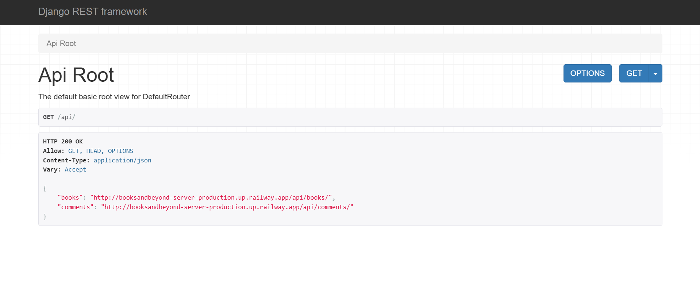

[Link](https://booksandbeyond-v2-0-server.onrender.com/api/)


Why I feel API-based architecture (DRF) is better than traditional Django views?  

Instead of using **traditional Django views**, we opted for a **RESTful API using DRF**. Here’s why:  

1️⃣ **Separation of Concerns**  
   - The **backend (DRF)** handles data logic, while **React** focuses on UI.  
   - Makes code **more modular and maintainable**.  

2️⃣ **Scalability**  
   - APIs can serve multiple frontends (Web, Mobile, etc.).  
   - A **React frontend can be easily replaced or updated** without touching the backend.  

3️⃣ **Performance**  
   - DRF allows for **optimized data retrieval** using serialization.  
   - Reduces **redundant database queries** compared to traditional Django templates.  

4️⃣ **Security**  
   - **JWT authentication** ensures secure login across devices.  
   - **CORS handling** protects the API from unauthorized access.  

🎥 **[I was influenced by this video](https://www.youtube.com/watch?v=ufgjBJa2M70)**

[🔝 Back to Top](#-table-of-contents)

---

## 🧪 Testing

### 📱 Responsiveness  
Testing was conducted on multiple devices, including a **Lenovo Ideapad Laptop** and a **Samsung Galaxy A5**, using the latest versions of **Google Chrome, Mozilla Firefox, and Opera**. For more detailed testing, **Google DevTools** was used to simulate different screen sizes.  

#### **Tested Pages**  
- **Home Page** ✅  

- **Books Page** ✅  
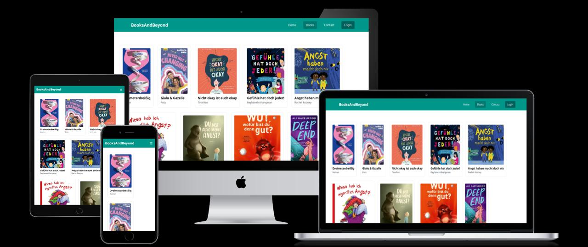
- **Book Details Page** ✅  
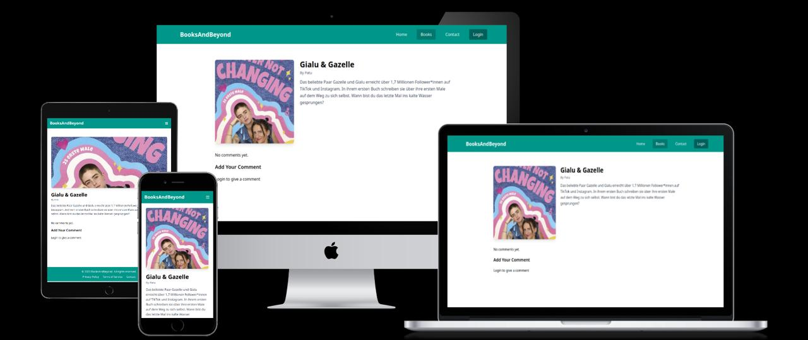
- **Contact Page** ✅  
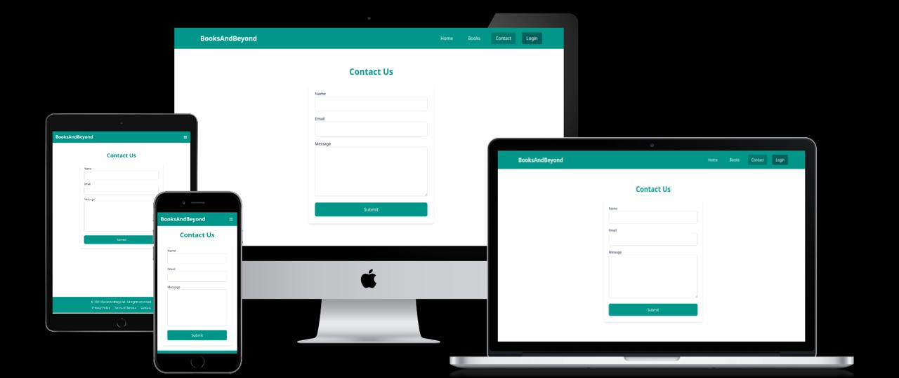
---

### ✅Manual Testing  

#### **Account Registration Tests**  
| Test | Result |
|------|--------|
| User can create a profile | ✅ Pass |
| User can log into profile | ✅ Pass |
| User can log out of profile | ✅ Pass |
| Comments are displaying correctly | ✅ Pass |
| Comments are dismissable by button and timeout | ✅ Pass |

#### **User Navigation Tests**  
| Test | Result |
|------|--------|
| User can easily navigate to the books section | ✅ Pass |
| User can access the Contact page | ✅ Pass |s |
| User can comment on a book | ✅ Pass |
| SuperUser can access the admin page | ✅ Pass |

#### **Account Authorization Tests**  
| Test | Result |
|------|--------|
| Only SuperUser can access the admin panel | ✅ Pass |
| Non-authorized users cannot access profile page | ✅ Pass |
| Non-authorized users cannot comment on a book | ✅ Pass |

#### **Book & Profile Management Tests**  
| Test | Result |
|------|--------|
| User can view all available books | ✅ Pass |
| User can view book details | ✅ Pass |
| User can leave a comment on a book | ✅ Pass |
| User can edit their profile details | ✅ Pass |
| User can delete their profile | ✅ Pass |
| Confirmation messages appear after successful actions | ✅ Pass |

#### **Admin Panel Tests**  
| Test | Result |
|------|--------|
| Items display correctly when updated/added | ✅ Pass |
| Admin can approve or delete user comments | ✅ Pass |

---

## ✅ Code Quality – PEP8 Compliance

We follow Python's official **PEP8** style guide across all Python-based scripts and backend modules.  

- ✔️ All Python files are linted using `flake8`  
- ✔️ No PEP8 errors or warnings in current codebase  
- ✔️ Compliant with naming conventions, indentation, imports, line length, and whitespace

> This ensures that the code remains clean, consistent, and easy to maintain or contribute to.

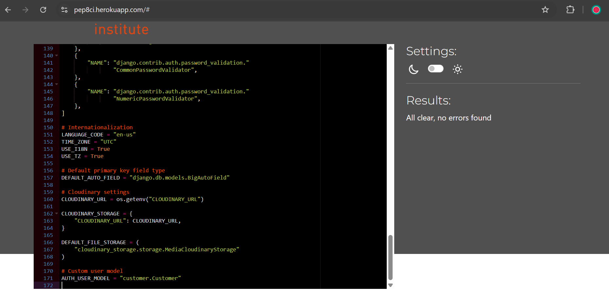

---

### 🐞 Known Bugs and Issues

- 🔹 **UI Misalignment on Mobile:** On smaller screen sizes, some layout components such as comment cards and buttons may overlap or shift unexpectedly.
- 🔹 **Default Form Button Styling:** The default green submit button rendered by the form library doesn't match the app's design system.
- 🔹 **Scroll Position Bug:** When navigating between routes, the scroll position does not reset to the top, leading to disorienting navigation.
- 🔹 **Comment Timestamp Format:** In some cases, the comment timestamp displays in raw format instead of a user-friendly "time ago" format.
- 🔹 **Modal Accessibility Issue:** Modal dialogs for adding comments do not properly trap focus, affecting keyboard navigation and accessibility.

**📌 Note:** These bugs are tracked and prioritized for future sprints. None of them critically affect the core features or user flow.


[🔝 Back to Top](#-table-of-contents)

# 🚀 Deployment

I deployed my fullstack Django + React project on [Render.com](https://render.com/). I chose Render over other services because it offers easy PostgreSQL integration, robust persistent storage, and seamless Cloudinary support for media management.

---

## Why I Chose Render

- *Persistent Storage*: Render provides reliable persistent storage and automatic scaling, making it perfect for my Django backend.
- *PostgreSQL Database*: Render offers managed PostgreSQL databases, which I use for my production database, ensuring stability and performance.
- *Cloudinary Integration*: For handling media files like images, I use Cloudinary, which is integrated seamlessly for file storage and CDN delivery.

---

## 1. Setting Up My Render Project

1. Signed up at [Render.com](https://render.com/).
2. Created a new Web Service and connected my GitHub repository.

---

## 2. Deploying My Backend (Django)

### 2.1 Setting Up `Procfile`
To tell Render how to run my application, I created a `Procfile` in my Django project root:

```
echo 'web: gunicorn myproject.wsgi' > Procfile
````
### 2.2 Installing Dependencies
Make sure my requirements.txt includes the following dependencies for Django, PostgreSQL, Cloudinary, and other necessary packages:

```
gunicorn               # WSGI HTTP Server for running Django in production
django                 # The main framework for the backend
django-cors-headers    # To handle Cross-Origin Resource Sharing (CORS)
djangorestframework    # For building the API with Django REST Framework
dotenv                 # To manage environment variables from `.env` file
psycopg2               # PostgreSQL adapter for Python
cloudinary             # Cloudinary SDK for Python
django-cloudinary-storage  # Django storage backend for Cloudinary integration
````

### 2.3 Configuring settings.py
I modified the settings.py file to work with PostgreSQL, Cloudinary, and environment variables.

Database Configuration (PostgreSQL)
I updated the database settings to use PostgreSQL and used dj_database_url to parse the database URL provided by Render:

```
import os
import dj_database_url

DEBUG = False
ALLOWED_HOSTS = ['*']

# PostgreSQL Database Configuration
DATABASE_URL = os.getenv('DATABASE_URL')
DATABASES = {
    'default': dj_database_url.config(default=DATABASE_URL)
}
```
### 2.3 Configuring settings.py
I modified the settings.py file to work with PostgreSQL, Cloudinary, and environment variables.

Database Configuration (PostgreSQL)
I updated the database settings to use PostgreSQL and used dj_database_url to parse the database URL provided by Render:

```
import os
import dj_database_url

DEBUG = False
ALLOWED_HOSTS = ['*']

# PostgreSQL Database Configuration
DATABASE_URL = os.getenv('DATABASE_URL')
DATABASES = {
    'default': dj_database_url.config(default=DATABASE_URL)
}

```
Cloudinary Configuration (File Storage)
I configured Cloudinary for media file storage:

```
import cloudinary
import cloudinary.uploader
import cloudinary.api

# Cloudinary settings
CLOUDINARY_STORAGE = {
    'CLOUDINARY_URL': os.getenv("CLOUDINARY_URL"),
}

DEFAULT_FILE_STORAGE = 'cloudinary_storage.storage.MediaCloudinaryStorage'

# Media settings
MEDIA_URL = "/media/"
MEDIA_ROOT = BASE_DIR / "media"
````
### 2.4 Adding Static Files Support
To support static files, I configured the following in settings.py:
```
STATIC_URL = '/static/'
STATIC_ROOT = os.path.join(BASE_DIR, 'staticfiles')
```

### 2.5 Deploying the Backend
Once the changes were made, I committed and pushed them to GitHub. In Render, I followed these steps:
```
Created a new Web Service → GitHub Repo → Selected backend.
Set PYTHON_VERSION=3.9 in Environment Variables.
Set DATABASE_URL (provided by Render) in Environment Variables.
Set CLOUDINARY_URL (obtained from Cloudinary) in Environment Variables.
Clicked Deploy.
```
---
## 3. Deploying the Frontend (React)
I deployed the React frontend on Render as well by creating a Static Site.

- Created a new Static Site on Render.
- Connected the frontend GitHub repository.
- Set the Build Command (e.g., npm run build) and the Publish Directory (e.g., build/).
- Clicked Deploy.

- 
---

## 3. Deploying My Frontend (React)

### 3.1 Building My React App

I ensured package.json had:

json
"scripts": {
  "build": "react-scripts build"
}


Then, I ran:

sh
npm install
npm run build


### 3.2 Serving React with Django
I moved the build/ folder to Django’s static/:

sh
mv build/ myproject/static/


Then, I updated Django urls.py:

python
from django.views.generic import TemplateView
urlpatterns += [
    path('', TemplateView.as_view(template_name='index.html')),
]


### 3.3 Deploying the Frontend
I committed the changes and pushed them to GitHub. Then, in Railway:

1. Added a new service → *GitHub Repo* → Selected frontend.
2. Set NODE_ENV=production.
3. Clicked *Deploy*.

---

## 4. Final Steps

### 4.1 Migrating My Database
In Render, I opened the *backend terminal* and ran:

sh
python manage.py migrate


### 4.2 Creating a Superuser

sh
python manage.py createsuperuser

## 🎉 Deployment Completed!
My Django + React app is now live on Render! 🚀


[🔝 Back to Top](#-table-of-contents)

---

## 📚 Resources  
- **[Django Rest Framework Docs](https://www.django-rest-framework.org/)**  
- **[React Docs](https://reactjs.org/)**  
- **[Render Deployment Guide](https://docs.render.com/)**  

----

## 🙌 Credits & Acknowledgements  

This project was made possible through the collective efforts of various open-source communities, online learning platforms, and helpful resources. Special thanks to the following:

### 🔹 **YouTube Tutorials & Guides**  
1. [Django Rest Framework Full Course](https://www.youtube.com/watch?v=ufgjBJa2M70)  
2. [React & Django Integration](https://www.youtube.com/watch?v=4F2m91eKmts)  
3. [Building a Full-Stack App](https://www.youtube.com/watch?v=mrHNSanmqQ4)  
4. [Django Authentication System](https://www.youtube.com/watch?v=eBsc65jTKvw)  
5. [React Hooks & State Management](https://www.youtube.com/watch?v=6ThXsUwLWvc)  
6. [Tailwind CSS for Beginners](https://www.youtube.com/watch?v=F4xZ7XVdU1A)  
7. [React Router Explained](https://www.youtube.com/watch?v=Law7wfdg_ls)  
8. [JWT Authentication in Django](https://www.youtube.com/watch?v=F8PRrnc5MyY)  
9. [SQLite Database Optimization](https://www.youtube.com/watch?v=2LyzBoHo5EI)  
10. [Deploying Django + React on Railway](https://www.youtube.com/watch?v=WpFL7kZ-c9g)  
11. [Best UX/UI Practices](https://www.youtube.com/watch?v=_Q-FQsJpU-I)  
12. [Kanban Board & Agile Development](https://www.youtube.com/watch?v=R8dYLbJiTUE)  
13. [Django Deploy with Render, PostgreSQL, Cloudinary, Gmail, Github & Tailwind](http://youtube.com/watch?v=IkHKg5Unniw)  

### 🔹 **Development & Learning Platforms**  
- [Django Rest Framework Official Docs](https://www.django-rest-framework.org/)  
- [React Official Documentation](https://react.dev/)  
- [PostgreSql Documentation](https://www.postgresql.org/docs/)  
- [Render Deployment Docs](https://render.com/docs/)  
- [MDN Web Docs](https://developer.mozilla.org/en-US/)  
- [W3Schools](https://www.w3schools.com/)  

### 🔹 **Tools & Libraries Used**  
- **Django & DRF** for backend development  
- **React & React Router** for frontend development  
- **Tailwind CSS** for responsive UI  
- **JWT Authentication** for secure user management  
- **Lucidchart** for database planning  
- **GitHub Projects** for task tracking  
- **Google DevTools** for testing  

### 🔹 **Special Thanks**  
A huge thank you to my mentor Spencer Barriball, a person who always dedicated time to help me and not just even in live meetings but also through Slack the whole time.
Another thank you to Prolet in StudentsCare who was a real help answering to my inquiries and helping with giving me the proper prolonging papers when I got sick. And to all the people in CodeInstitue who are working on supporting me and my fellow learners,..Thank you.


[🔝 Back to Top](#-table-of-contents)